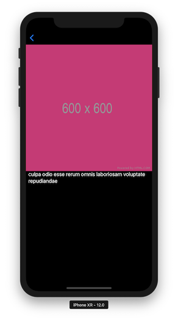

# PhotoApp

The goal of the project is to get first hand experience with building the same mobile app with every available tool and compare them.

| Tool            | List Screen | Detail Screen | Notes                                                                                          |
|-----------------|-------------|---------------|------------------------------------------------------------------------------------------------|
| uikit-swift     | ✅           | ✅             |                                                                                                |
| uikit-objc-arc  | ✅           | ✅             |                                                                                                |
| uikit-objc      | ✅           | ✅             |                                                                                                |
| component-kit   | ✅           | ✅             | https://whackylabs.com/ios/2018/11/09/hello-component-kit/                                     |
| Flutter         | ✅           | ✅             | https://whackylabs.com/flutter/app/cross-platform/2018/12/14/hello-flutter/                    |
| react-native    | ✅           | ✅             | https://whackylabs.com/reactnative/ios/android/js/2024/01/15/hello-react-native-one-more-time/ |
| swiftui         | ✅           | ✅             |                                                                                                |
| dotnet-maui     | ✅           | ✅             | https://whackylabs.com/maui/ios/android/2024/01/23/hello-maui/                                 |
| jetpack-compose | ✅           | ✅             | https://whackylabs.com/kotlin/compose/navigation/2024/08/16/jetpack-compose-navigation/        |
| react           | ✅           | ✅             | https://whackylabs.com/kotlin/compose/navigation/2024/08/16/jetpack-compose-navigation/        |
| ionic           | ✅           | ✅             | https://whackylabs.com/js/ionic/ios/android/2024/09/06/hello-ionic/                            |
| android         | ✅           | ✅             | https://whackylabs.com/kotlin/xml/android/2024/12/28/android-xml/                              |
| djinni          | ❌           | ❌             | https://whackylabs.com/djinni/cpp/ios/android/2018/11/23/cross-platform-cpp/                   |
| boden           | ❌           | ❌             | https://whackylabs.com/x-platform/cpp/2019/06/01/cpp-x-platform/                               |

### Description

The app has 3 screens:

* A loading screen
* A list screen that fetches and draws a list of images (think 2 column UICollectionView)
* A details screen that displays details payload.

### Screenshots

